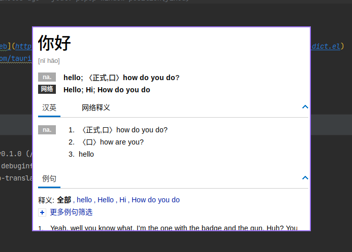

# Popup translation

A translation tool is realized by providing the ability of webview through wry.



## 📦 Install

```shell
cargo install --git https://github.com/fzdwx/popup-translation
```

## 💥 Supported platforms

1. [Bing](https://www.bing.com/)
2. [Youdao](https://www.youdao.com/)
3. [YouGlish](https://youglish.com/)
4. [Dict](https://dict.cn/)

## 🦹 TODO

- [ ] Position Options( current version is fixed)
    - e.g: `top_left`, `top_center`, `top_right`, `center` ...
- [ ] HotKey
    - open
    - close

## 📖 Thanks

1. [manateelazycat - popweb](https://github.com/manateelazycat/popweb/blob/main/extension/dict/popweb-dict.el)
2. [wry](https://github.com/tauri-apps/wry)

## License

MIT